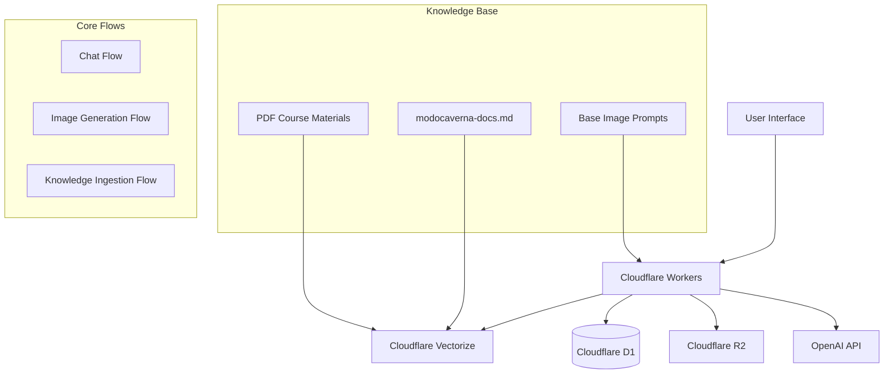

# Design Document

## Overview

The "Ask the Captain" platform is designed as a comprehensive AI-powered mentorship system that embodies the Capitão Caverna persona from the Modo Caverna methodology. The system combines state-of-the-art semantic search with dynamic image generation to create an immersive, contextually-aware chat experience that guides users through their personal transformation journey.

The platform operates on a Cloudflare-native architecture, leveraging edge computing for minimal latency and optimal performance. The design emphasizes the core philosophy of Purpose > Focus > Progress, providing users with direct, actionable guidance based on the extensive Modo Caverna knowledge base.

## Architecture

### High-Level System Architecture



### Edge-First Architecture

The entire system runs on Cloudflare's edge network, ensuring:
- **Minimal Latency**: All processing happens at edge locations closest to users
- **Unified Operations**: Single platform for compute, storage, and networking
- **Automatic Scaling**: Serverless architecture scales based on demand
- **Global Distribution**: Content and compute distributed worldwide

### Technology Stack

- **Runtime**: Cloudflare Workers (V8 isolates)
- **Web Framework**: Next.js with OpenNext adapter
- **Vector Database**: Cloudflare Vectorize for semantic search
- **Relational Database**: Cloudflare D1 for metadata and future user data
- **Object Storage**: Cloudflare R2 for generated images
- **AI Services**: OpenAI API for embeddings, chat completions, and image generation

## Components and Interfaces

### 1. Frontend Components

#### UI/UX Design Foundation

**Base Repository Integration:**
The frontend design is built upon the glass-ask-ai repository (https://github.com/hudsonargollo/glass-ask-ai.git) with significant enhancements for the Modo Caverna brand identity and improved user experience.

**Key Design Enhancements:**
- **Improved Contrast**: Enhanced text contrast ratios for better readability
- **Cave Theme Integration**: Dark, immersive color scheme reflecting the cave metaphor
- **Brand Consistency**: Modo Caverna red accents and wolf logo integration
- **Accessibility**: WCAG 2.1 AA compliance for inclusive design
- **Performance**: Optimized glass effects for smooth performance across devices

#### Chat Interface Component
```typescript
interface ChatInterfaceProps {
  messages: ChatMessage[]
  onSendMessage: (message: string) => Promise<void>
  isLoading: boolean
  captainImage: string
}

interface ChatMessage {
  id: string
  content: string
  role: 'user' | 'assistant'
  timestamp: Date
  imageUrl?: string
}
```

**Design Principles:**
- **Glass Morphism Foundation**: Based on glass-ask-ai repository aesthetic with glassmorphism effects
- **Modo Caverna Branding**: Dark theme with cave-inspired color palette and red accent colors (#FF3333)
- **Enhanced Contrast**: Improved text contrast ratios for better readability and accessibility
- **Single-column Layout**: Optimized for focus with minimal distractions
- **Responsive Design**: Seamless experience across desktop and mobile devices
- **Smooth Transitions**: Fluid animations for image updates and UI interactions

#### Visual Design System

**Color Palette:**
- **Primary Background**: Dark cave-inspired gradients (#1a1a1a to #2d2d2d)
- **Glass Elements**: Semi-transparent overlays with backdrop blur effects
- **Accent Color**: Modo Caverna red (#FF3333) for CTAs and highlights
- **Text Colors**: High contrast whites (#ffffff) and light grays (#e0e0e0)
- **Secondary Elements**: Warm cave lighting tones (#FFA500, #FFD700)

**Typography:**
- **Primary Font**: Modern sans-serif with excellent readability
- **Hierarchy**: Clear distinction between headings, body text, and UI elements
- **Contrast Ratios**: Minimum 4.5:1 for normal text, 7:1 for enhanced readability

**Glass Morphism Effects:**
- **Chat Bubbles**: Semi-transparent backgrounds with subtle blur
- **Input Fields**: Glass-like appearance with enhanced border visibility
- **Navigation Elements**: Frosted glass effect maintaining cave theme
- **Captain Image Container**: Elegant glass frame with cave-inspired borders

#### Captain Image Display Component
```typescript
interface CaptainImageProps {
  imageUrl: string
  isGenerating: boolean
  onImageLoad: () => void
  fallbackImage: string
}
```

**Features:**
- **Dynamic Image Updates**: Context-aware image generation based on conversation
- **Glass Frame Design**: Elegant glass morphism container with cave-themed borders
- **Loading States**: Smooth loading animations with cave-inspired visual effects
- **Transition Effects**: Fluid crossfade transitions between images
- **Fallback Handling**: Graceful degradation with default Captain images
- **Responsive Sizing**: Adaptive image sizing for different screen sizes

**Visual Implementation:**
- **Container**: Glass morphism effect with subtle cave lighting reflections
- **Border**: Red accent border (#FF3333) matching Modo Caverna branding
- **Shadow Effects**: Depth-creating shadows that enhance the cave atmosphere
- **Loading Animation**: Cave-themed loading spinner with torch-like effects

### Detailed UI/UX Specifications

#### Layout Structure (Based on glass-ask-ai)
```typescript
interface LayoutComponents {
  header: {
    logo: string // Modo Caverna branding
    navigation: NavigationItem[]
    userActions: ActionButton[]
  }
  mainContent: {
    chatContainer: ChatContainerProps
    captainDisplay: CaptainDisplayProps
    inputArea: MessageInputProps
  }
  sidebar?: {
    quickActions: QuickAction[]
    sessionHistory: SessionItem[]
  }
}
```

#### Glass Morphism Implementation
```css
/* Enhanced glass effects with improved contrast */
.glass-container {
  background: rgba(26, 26, 26, 0.8);
  backdrop-filter: blur(20px);
  border: 1px solid rgba(255, 51, 51, 0.2);
  border-radius: 16px;
  box-shadow: 
    0 8px 32px rgba(0, 0, 0, 0.3),
    inset 0 1px 0 rgba(255, 255, 255, 0.1);
}

.chat-bubble {
  background: rgba(45, 45, 45, 0.9);
  backdrop-filter: blur(10px);
  border: 1px solid rgba(255, 255, 255, 0.1);
  color: #ffffff;
  /* Enhanced contrast for readability */
}

.input-field {
  background: rgba(26, 26, 26, 0.7);
  border: 2px solid rgba(255, 51, 51, 0.3);
  color: #ffffff;
  /* High contrast placeholder text */
  &::placeholder {
    color: rgba(224, 224, 224, 0.7);
  }
}
```

#### Responsive Design Breakpoints
```typescript
interface ResponsiveBreakpoints {
  mobile: '320px - 768px'
  tablet: '768px - 1024px'
  desktop: '1024px+'
  
  adaptations: {
    mobile: {
      chatLayout: 'single-column'
      captainImage: 'compact-mode'
      navigation: 'hamburger-menu'
    }
    tablet: {
      chatLayout: 'split-view'
      captainImage: 'side-panel'
      navigation: 'tab-bar'
    }
    desktop: {
      chatLayout: 'full-width'
      captainImage: 'prominent-display'
      navigation: 'full-header'
    }
  }
}
```

#### Accessibility Enhancements
- **Color Contrast**: Minimum 7:1 ratio for text elements
- **Focus Indicators**: High-visibility focus rings with cave theme
- **Screen Reader Support**: Comprehensive ARIA labels and descriptions
- **Keyboard Navigation**: Full keyboard accessibility for all interactions
- **Motion Preferences**: Respect for reduced motion preferences

### 2. API Layer

#### Chat API Endpoint (`/api/chat`)
```typescript
interface ChatRequest {
  message: string
  conversationId?: string
}

interface ChatResponse {
  response: string
  imageUrl: string
  conversationId: string
}
```

**Processing Flow:**
1. Receive user query
2. Generate query embedding using OpenAI
3. Perform semantic search via Vectorize
4. Construct system prompt with persona + context
5. Generate AI response via OpenAI
6. Trigger contextual image generation
7. Return response with image URL

#### Image Generation API (`/api/v1/images/generate`)
```typescript
interface ImageGenerationRequest {
  responseContent: string
  tone: string
  themes: string[]
}

interface ImageGenerationResponse {
  imageUrl: string
  imageId: string
  promptParameters: object
}
```

**Processing Flow:**
1. Analyze response content and tone
2. Select appropriate visual parameters from base prompts
3. Construct detailed DALL-E prompt
4. Generate image via OpenAI
5. Store image in R2 with unique identifier
6. Save metadata in D1
7. Return public R2 URL

### 3. Knowledge Base Processing

#### Document Ingestion Pipeline
```typescript
interface DocumentProcessor {
  processMarkdown(content: string): DocumentChunk[]
  processPDF(buffer: Buffer): DocumentChunk[]
  generateEmbeddings(chunks: DocumentChunk[]): EmbeddingVector[]
  storeInVectorize(embeddings: EmbeddingVector[]): Promise<void>
}

interface DocumentChunk {
  id: string
  content: string
  source: string
  metadata: {
    title?: string
    section?: string
    page?: number
  }
}
```

**Chunking Strategy:**
- Semantic chunking based on content structure
- Optimal chunk size: 500-1000 tokens
- Overlap between chunks: 100 tokens
- Preserve context boundaries (paragraphs, sections)

### 4. Semantic Search Engine

#### Vectorize Integration
```typescript
interface SemanticSearchService {
  search(query: string, limit: number): Promise<SearchResult[]>
  generateQueryEmbedding(query: string): Promise<number[]>
  rankResults(results: SearchResult[], query: string): SearchResult[]
}

interface SearchResult {
  content: string
  score: number
  metadata: {
    source: string
    section?: string
  }
}
```

**Search Strategy:**
- Hybrid search combining semantic similarity and keyword matching
- Result ranking based on relevance scores
- Context window optimization for prompt construction
- Fallback handling for low-relevance queries

## Data Models

### Database Schema (Cloudflare D1)

#### Generated Images Table
```sql
CREATE TABLE GeneratedImages (
  image_id TEXT PRIMARY KEY,
  r2_object_key TEXT NOT NULL,
  prompt_parameters TEXT, -- JSON
  response_context TEXT,
  tone_analysis TEXT,
  created_at DATETIME DEFAULT CURRENT_TIMESTAMP,
  INDEX idx_created_at (created_at)
);
```

#### Conversations Table (Future)
```sql
CREATE TABLE Conversations (
  id TEXT PRIMARY KEY,
  user_id TEXT, -- nullable for MVP
  message TEXT NOT NULL,
  response TEXT NOT NULL,
  image_id TEXT,
  embedding_query TEXT,
  search_results TEXT, -- JSON
  created_at DATETIME DEFAULT CURRENT_TIMESTAMP,
  FOREIGN KEY (image_id) REFERENCES GeneratedImages(image_id),
  INDEX idx_user_id (user_id),
  INDEX idx_created_at (created_at)
);
```

### Vector Data Model

#### Vectorize Index Structure
```typescript
interface VectorDocument {
  id: string
  values: number[] // OpenAI embedding (1536 dimensions)
  metadata: {
    content: string
    source: string
    title?: string
    section?: string
    chunk_index: number
    token_count: number
  }
}
```

### R2 Object Storage Structure

#### Image Storage Organization
```
/images/
  /generated/
    /{year}/
      /{month}/
        /{image_id}.png
  /fallbacks/
    /default-captain.png
    /loading-captain.png
```

## Error Handling

### Error Classification and Response Strategy

#### 1. User-Facing Errors
- **Invalid Input**: Graceful validation with helpful messages
- **Rate Limiting**: Clear communication about usage limits
- **Service Unavailable**: Fallback responses maintaining Captain persona

#### 2. System Errors
- **OpenAI API Failures**: Retry logic with exponential backoff
- **Vectorize Timeouts**: Fallback to cached results or general responses
- **R2 Storage Issues**: Fallback to default Captain images

#### 3. Data Consistency Errors
- **Database Constraints**: Transaction rollback with user notification
- **Vector Index Corruption**: Automatic reindexing triggers
- **Image Generation Failures**: Retry with simplified prompts

### Error Response Format
```typescript
interface ErrorResponse {
  error: {
    code: string
    message: string
    details?: object
    timestamp: string
  }
  fallback?: {
    response?: string
    imageUrl?: string
  }
}
```

### Monitoring and Alerting
- **Performance Metrics**: Response times, error rates, throughput
- **Business Metrics**: Conversation completion rates, user satisfaction
- **System Health**: Database connections, API quotas, storage usage

## Testing Strategy

### 1. Unit Testing
- **Component Testing**: React components with Jest and Testing Library
- **API Testing**: Endpoint logic with mocked dependencies
- **Utility Testing**: Helper functions and data transformations

### 2. Integration Testing
- **API Integration**: End-to-end API flows with test databases
- **External Services**: OpenAI API integration with test keys
- **Database Operations**: D1 and Vectorize operations

### 3. End-to-End Testing
- **User Flows**: Complete conversation flows from UI to response
- **Image Generation**: Full image creation and display pipeline
- **Knowledge Base**: Search accuracy and response quality

### 4. Performance Testing
- **Load Testing**: Concurrent user simulation
- **Latency Testing**: Response time optimization
- **Scalability Testing**: Edge performance under load

### Testing Environment Setup
```typescript
// Test configuration
interface TestConfig {
  openai: {
    apiKey: string
    model: string
    testMode: boolean
  }
  cloudflare: {
    accountId: string
    d1DatabaseId: string
    vectorizeIndexId: string
    r2BucketName: string
  }
  testData: {
    sampleQueries: string[]
    expectedResponses: object[]
    mockImages: string[]
  }
}
```

### Quality Assurance Metrics
- **Response Accuracy**: Semantic relevance to knowledge base
- **Persona Consistency**: Adherence to Capitão Caverna character
- **Image Relevance**: Visual alignment with response context
- **Performance Benchmarks**: Sub-2-second response times

## Capitão Caverna Persona Implementation

### Character Consistency Framework

#### Core Personality Traits
- **Direct and Uncompromising**: No sugar-coating or false comfort
- **Action-Oriented**: Every response includes actionable steps
- **Disciplined Mentor**: Treats user as "warrior who has awakened"
- **Purpose-Driven**: Aligns all guidance with Purpose > Focus > Progress

#### Response Generation Guidelines
```typescript
interface PersonaPrompt {
  systemPrompt: string
  contextualModifiers: {
    supportive: string
    challenging: string
    instructional: string
    motivational: string
  }
  prohibitedLanguage: string[]
  requiredElements: string[]
}
```

#### Tone Analysis for Image Generation
```typescript
interface ToneAnalysis {
  primary: 'supportive' | 'challenging' | 'instructional' | 'motivational'
  intensity: 'low' | 'medium' | 'high'
  themes: string[]
  visualParameters: {
    pose: string
    expression: string
    environment: string
    lighting: string
  }
}
```

### Image Generation Context Mapping

#### Base Character Specifications
- **Physical**: Pixar-style wolf, athletic build, 6-head proportions
- **Attire**: Black hoodie with red triangle logo, black sweatpants, asymmetric sneakers
- **Environment**: Natural cave interior with dramatic lighting
- **Consistency**: Unified HDRI, consistent proportions, brand-accurate logo

#### Contextual Variations
- **Welcoming**: Open posture, slight smile, warm lighting
- **Challenging**: Firm stance, intense gaze, dramatic shadows
- **Instructional**: Gesture-based poses, focused expression, clear lighting
- **Motivational**: Heroic stance, confident expression, inspiring environment

This design provides a comprehensive foundation for building the "Ask the Captain" platform while maintaining flexibility for future enhancements and ensuring optimal user experience through the Cloudflare-native architecture.