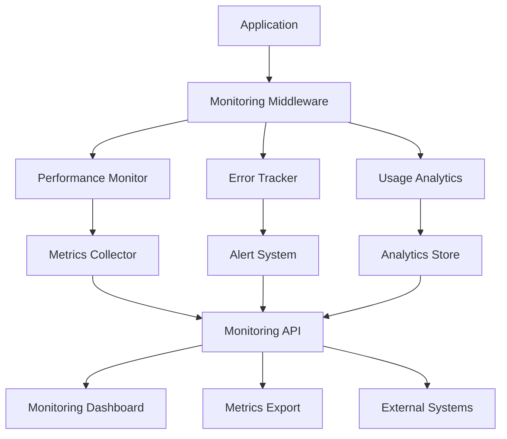

# Monitoring and Observability Guide

This guide covers the comprehensive monitoring and observability system for Ask the Captain.

## Overview

The monitoring system provides:
- **Performance Monitoring**: Request metrics, response times, cache hit rates
- **Error Tracking**: Comprehensive error logging, categorization, and alerting
- **Usage Analytics**: User behavior tracking, feature usage, and business metrics
- **Health Monitoring**: System health checks and service availability
- **Alerting**: Automated alerts for performance and error thresholds
- **Metrics Export**: Prometheus-compatible metrics for external monitoring

## Architecture



## Components

### 1. Performance Monitoring

**Location**: `lib/performance-monitoring.ts`

Tracks:
- Request/response metrics
- Memory usage
- Cache performance
- Geographic distribution
- Response time percentiles

**Key Metrics**:
- Average response time
- P95/P99 response times
- Request throughput
- Cache hit rate
- Memory utilization
- Error rates

### 2. Error Tracking

**Location**: `lib/error-tracking.ts`

Features:
- Error categorization (API, Database, External Service, Validation, System)
- Error aggregation and deduplication
- Alert rules and notifications
- Error trend analysis
- Stack trace capture

**Error Categories**:
- `api`: API endpoint errors
- `database`: D1 database errors
- `external_service`: OpenAI, Vectorize, R2 errors
- `validation`: Input validation errors
- `system`: System-level errors

### 3. Usage Analytics

**Location**: `lib/usage-analytics.ts`

Tracks:
- User sessions and journeys
- Feature usage patterns
- Conversation metrics
- Geographic distribution
- Content performance

**Key Events**:
- Page views
- Chat messages
- Image generations
- Search queries
- Feature usage

### 4. Monitoring Middleware

**Location**: `lib/monitoring-middleware.ts`

Provides:
- Automatic request tracking
- Error capture and categorization
- Performance metric collection
- Context propagation
- Response header injection

## API Endpoints

### Health Check

```bash
GET /api/health
```

Returns system health status and connectivity checks.

**Response**:
```json
{
  "timestamp": "2025-01-08T10:00:00.000Z",
  "environment": "production",
  "status": "healthy",
  "checks": {
    "database": { "status": "healthy" },
    "vectorize": { "status": "healthy" },
    "r2": { "status": "healthy" },
    "openai": { "status": "healthy" }
  },
  "responseTime": 150,
  "version": "0.1.0"
}
```

### Monitoring Dashboard

```bash
GET /api/monitoring?type=overview&startTime=1641600000000&endTime=1641686400000
```

**Parameters**:
- `type`: `overview`, `performance`, `errors`, `usage`, `alerts`, `recommendations`
- `startTime`: Unix timestamp (optional, defaults to 24 hours ago)
- `endTime`: Unix timestamp (optional, defaults to now)

**Response Types**:

#### Overview
```json
{
  "system": {
    "status": "healthy",
    "uptime": "99.9%",
    "version": "0.1.0",
    "environment": "production"
  },
  "performance": {
    "averageResponseTime": 1250,
    "p95ResponseTime": 2100,
    "requestsPerMinute": 45,
    "cacheHitRate": 0.72,
    "memoryUtilization": 65.3
  },
  "reliability": {
    "successRate": 99.2,
    "errorRate": 0.8,
    "totalErrors": 12,
    "criticalErrors": 2
  },
  "usage": {
    "totalSessions": 156,
    "totalMessages": 892,
    "totalImages": 234,
    "activeUsers": 89,
    "averageSessionDuration": 180000
  },
  "alerts": {
    "total": 3,
    "critical": 1,
    "warnings": 2
  }
}
```

### Metrics Export

```bash
GET /api/metrics?format=prometheus&type=performance
```

**Parameters**:
- `format`: `json`, `csv`, `prometheus`
- `type`: `performance`, `errors`, `usage`, `prometheus`
- `startTime`: Unix timestamp (optional)
- `endTime`: Unix timestamp (optional)

**Formats**:
- **JSON**: Structured data for programmatic access
- **CSV**: Tabular data for spreadsheet analysis
- **Prometheus**: Metrics format for Prometheus monitoring

## Usage Examples

### Basic Health Check

```bash
# Check system health
curl https://your-domain.com/api/health

# Simple uptime check
curl -I https://your-domain.com/api/health
```

### Get Monitoring Overview

```bash
# Get last 24 hours overview
curl "https://your-domain.com/api/monitoring?type=overview"

# Get specific time range
curl "https://your-domain.com/api/monitoring?type=overview&startTime=1641600000000&endTime=1641686400000"
```

### Export Metrics

```bash
# Export as Prometheus metrics
curl "https://your-domain.com/api/metrics?format=prometheus" > metrics.txt

# Export performance data as CSV
curl "https://your-domain.com/api/metrics?format=csv&type=performance" > performance.csv

# Export error logs as JSON
curl "https://your-domain.com/api/metrics?format=json&type=errors" > errors.json
```

### Resolve Alerts

```bash
# Resolve a performance alert
curl -X POST https://your-domain.com/api/monitoring \
  -H "Content-Type: application/json" \
  -d '{"action": "resolve", "alertId": "alert_123", "alertType": "performance"}'
```

## Alert Configuration

### Default Alert Rules

1. **High Error Rate**: Triggers when error rate > 5% over 5 minutes
2. **Critical Errors**: Triggers on any error-level event
3. **Database Error Spike**: Triggers on 3x increase in database errors
4. **High Response Time**: Triggers when average response time > 5 seconds
5. **Memory Usage**: Triggers when memory usage > 100MB

### Custom Alert Rules

```typescript
// Add custom alert rule
errorTracker.addAlertRule({
  name: 'OpenAI API Failures',
  condition: {
    type: 'error_count',
    threshold: 5,
    timeWindow: 10, // minutes
    category: 'external_service'
  },
  actions: [
    {
      type: 'webhook',
      config: {
        url: 'https://hooks.slack.com/your-webhook',
        headers: { 'Content-Type': 'application/json' }
      }
    }
  ],
  enabled: true
});
```

## Integration with External Systems

### Prometheus Integration

1. Configure Prometheus to scrape metrics:

```yaml
# prometheus.yml
scrape_configs:
  - job_name: 'ask-the-captain'
    static_configs:
      - targets: ['your-domain.com']
    metrics_path: '/api/metrics'
    params:
      format: ['prometheus']
    scrape_interval: 30s
```

2. Set up Grafana dashboard using the exported metrics

### Slack Notifications

Configure webhook alerts for critical issues:

```typescript
// In your deployment
process.env.SLACK_WEBHOOK_URL = 'https://hooks.slack.com/your-webhook';

// Alert will automatically post to Slack
```

### Log Aggregation

Export logs to external systems:

```bash
# Export error logs
curl "https://your-domain.com/api/metrics?format=json&type=errors" | \
  jq '.[] | select(.level == "error")' | \
  curl -X POST https://your-log-service.com/api/logs \
    -H "Content-Type: application/json" \
    -d @-
```

## Performance Optimization

### Monitoring Best Practices

1. **Metric Retention**: Keep only recent metrics in memory (configurable limits)
2. **Sampling**: Use sampling for high-volume metrics in production
3. **Batching**: Batch external API calls for analytics
4. **Caching**: Cache aggregated metrics for dashboard queries

### Resource Usage

- **Memory**: ~10-50MB for monitoring data (configurable)
- **CPU**: <5% overhead for metric collection
- **Network**: Minimal impact, only for external integrations

## Troubleshooting

### Common Issues

#### 1. High Memory Usage
```bash
# Check memory metrics
curl "https://your-domain.com/api/monitoring?type=performance" | \
  jq '.data.metrics.memory'

# Recommendations
curl "https://your-domain.com/api/monitoring?type=recommendations"
```

#### 2. Missing Metrics
```bash
# Verify monitoring middleware is active
curl -I https://your-domain.com/api/chat
# Should include X-Request-Id header

# Test monitoring system
npm run monitoring:test
```

#### 3. Alert Fatigue
```bash
# Check active alerts
curl "https://your-domain.com/api/monitoring?type=alerts"

# Resolve alerts
curl -X POST https://your-domain.com/api/monitoring \
  -d '{"action": "resolve", "alertId": "alert_123", "alertType": "performance"}'
```

### Debug Mode

Enable detailed logging:

```bash
# Set debug environment variable
export DEBUG_MONITORING=true

# Check logs for monitoring events
npm run dev
```

## Development and Testing

### Local Testing

```bash
# Test monitoring system
npm run monitoring:test

# Start development server with monitoring
npm run dev

# Check health endpoint
npm run health:check

# Open monitoring dashboard
npm run monitoring:dashboard
```

### Monitoring in Development

1. **Mock Data**: Use test script to generate sample data
2. **Local Dashboard**: Access monitoring at `http://localhost:3000/api/monitoring`
3. **Metrics Export**: Export test metrics for analysis

### Production Deployment

1. **Environment Variables**: Set monitoring configuration
2. **External Integrations**: Configure Prometheus, Slack, etc.
3. **Alert Thresholds**: Adjust for production traffic patterns
4. **Retention Policies**: Configure data retention limits

## Security Considerations

1. **Access Control**: Monitoring endpoints should be protected in production
2. **Data Privacy**: Avoid logging sensitive user data
3. **Rate Limiting**: Implement rate limiting for monitoring endpoints
4. **Audit Logging**: Log access to monitoring data

## Future Enhancements

1. **Real-time Dashboard**: WebSocket-based live monitoring
2. **Machine Learning**: Anomaly detection for performance metrics
3. **Distributed Tracing**: Request tracing across services
4. **Custom Dashboards**: User-configurable monitoring views
5. **Mobile Alerts**: Push notifications for critical issues

## Support

For monitoring-related issues:

1. Check the health endpoint first
2. Review monitoring logs
3. Export metrics for analysis
4. Use the test script to verify functionality
5. Check external integrations (Prometheus, Slack, etc.)